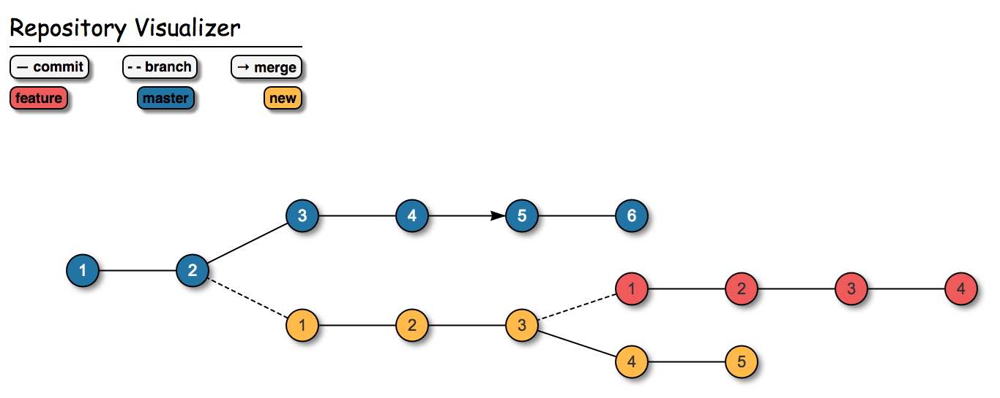

# Repo Vision

An `npm` package that allows your to visualize and interact with your local repository. View branches and commit messages, and checkout previous states of your project straight from the browser.



To run, simply:

  0. `npm install -g repo-vision`
  0. `rv-start`
  0. navigate to localhost:4000

---

## Options

* Specify the port

  ```
  rv-start --port=8080
  ```

* Specify a relative directory

  ```
  rv-start ./path/to/project/
  ```
